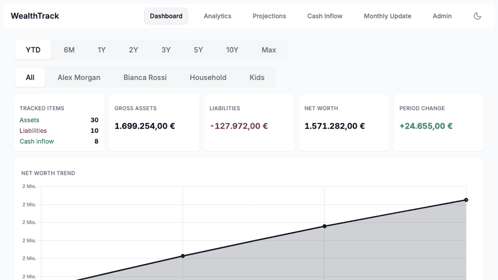
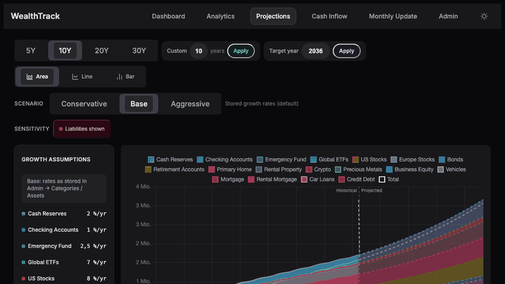
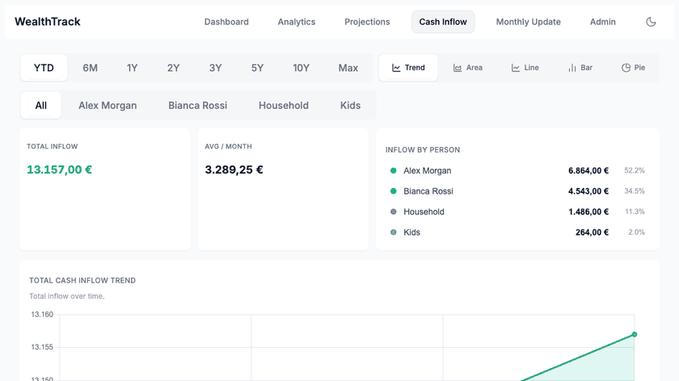
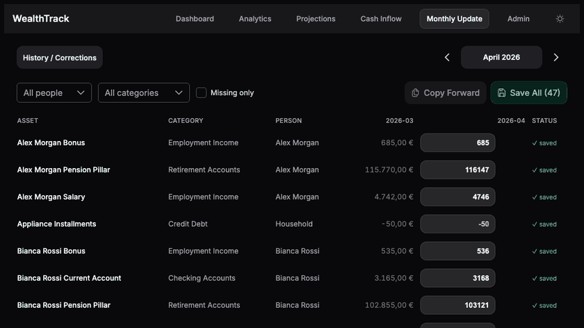

# WealthTrack

A self-hosted family net worth tracker with dead-simple data entry and beautiful visualizations. No cloud, no subscriptions — your data stays on your machine.


## Preview

| Overview (light) | Projections (dark) |
|---|---|
|  |  |

| Income (light) | Monthly update and admin (dark) |
|---|---|
|  |  |

## Features

- 📊 Track net worth across categories (stocks, real estate, crypto, cash, liabilities, …)
- 📈 Interactive charts — area, line, bar, and pie
- 🔮 Projections page with configurable growth rates and milestones
- 💸 Income tracking
- 🌙 Dark / light theme
- 🗃️ Data stored in plain YAML + CSV files — easy to back up and edit
- 🐳 Single Docker image, single port

## Quick Start (Docker)

```bash
# Pull and run
docker run -d \
  --name wealthtrack \
  -p 8080:8080 \
  -v $(pwd)/data:/data \
  ghcr.io/sasa-fajkovic/simple-wealth-tracker:latest

# Open in browser
open http://localhost:8080
```

Or with Docker Compose:

```yaml
# docker-compose.yml
services:
  wealthtrack:
    image: ghcr.io/sasa-fajkovic/simple-wealth-tracker:latest
    ports:
      - "8080:8080"
    volumes:
      - ./data:/data
    restart: unless-stopped
```

```bash
docker compose up -d
```

Data is persisted in `./data/` on the host (created automatically on first run).

## Development

### Prerequisites

- Node.js 20+
- npm

### Install dependencies

```bash
make install
```

### Start dev servers

```bash
make dev
```

This starts the Hono API server on **:3000** and the Vite dev server on **:5173**.  
Open [http://localhost:5173](http://localhost:5173).

### Build for production

```bash
make build
```

### Build Docker image locally

```bash
make docker-build
```

### Run Docker image locally

```bash
make docker-run
```

Open [http://localhost:8080](http://localhost:8080).

## Makefile reference

| Target | Description |
|---|---|
| `make install` | Install npm dependencies (server + web) |
| `make dev` | Start server and web in watch/dev mode |
| `make build` | TypeScript-compile server + Vite-build web |
| `make docker-build` | Build Docker image tagged `wealthtrack:latest` |
| `make docker-run` | Run the Docker image on port 8080 |
| `make docker-stop` | Stop and remove the running container |
| `make clean` | Remove build artefacts |

## Data directory

All persistent data lives in `/data` inside the container (mounted as a Docker volume):

| File | Description |
|---|---|
| `database.yaml` | Net worth snapshots by month and category |
| `datapoints.csv` | Granular data point entries |
| `logs/` | Audit log of all mutations |

## Environment variables

| Variable | Default | Description |
|---|---|---|
| `PORT` | `8080` | HTTP port |
| `DATA_FILE` | `/data/database.yaml` | Path to the YAML database |
| `DATA_POINTS_FILE` | `/data/datapoints.csv` | Path to the CSV data points file |
| `LOGS_DIR` | `/data/logs` | Directory for audit logs |
| `WEB_DIST` | `/app/web/dist` | Path to built web assets |
| `AUDIT_LOG_RETENTION_MONTHS` | `24` | Number of monthly audit log files to retain. `0` disables pruning. |

## Schema

The on-disk format is intentionally human-readable. The single source of truth
for shapes is [`server/src/models/index.ts`](server/src/models/index.ts).

### `database.yaml`

```yaml
categories:
  - id: stocks                       # URL-safe slug, immutable after create
    name: Stocks
    projected_yearly_growth: 0.08    # decimal, e.g. 0.08 = 8% / yr
    color: '#6366f1'
    type: asset                      # 'asset' | 'cash-inflow' | 'liability'
persons:
  - id: alice
    name: Alice
assets:
  - id: vanguard-vti
    name: Vanguard VTI
    category_id: stocks
    person_id: alice
    projected_yearly_growth: null    # null = inherit from category; 0 is a valid override
    location: Vanguard               # optional
    notes: ''                        # optional
    created_at: 2024-01-15T10:00:00Z
```

### `datapoints.csv`

`id,asset_id,year_month,value,notes,created_at,updated_at`

- `id` is a UUID v4 (one per data point).
- `year_month` is `YYYY-MM`. The frontend builds it from local-time integer
  parts via `toMonthKey(year, month)` — never `toISOString().slice(0,7)`,
  which UTC-shifts at local midnight for users in non-UTC timezones.
- `value` is the EUR amount as a float. Liability values must be ≤ 0.

### Invariants

- All writes go through `writeFileAtomic` (temp file + POSIX `rename(2)`).
- A single global mutex (`server/src/storage/mutex.ts`) serialises all
  reads and writes — concurrent requests are safe.
- Projection growth uses `(1+r)^(1/12) - 1` (compound monthly), not `r/12`.
- `asset.projected_yearly_growth !== null` overrides the category default.
  `0` is a valid override; do not check with truthiness.

## License

[MIT](LICENSE)
